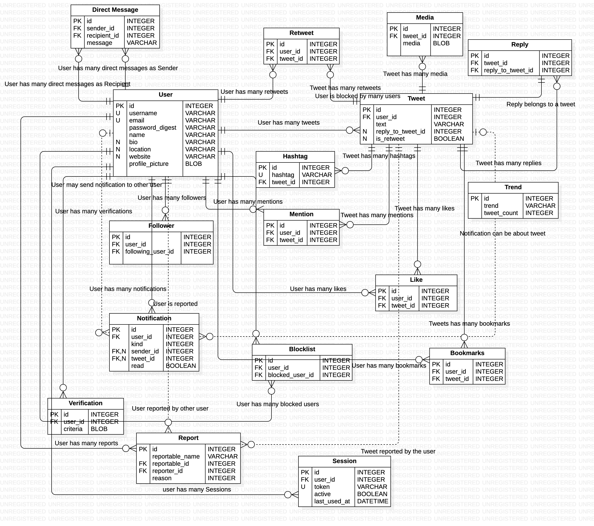

# README

# About

This is a GraphQL API for twitter clone. It is built with Ruby on Rails and GraphQL (Free). It is created by [Sulman Baig](https://sulmanweb.com).

# How to add Issue to project

You can submit any issue with code at [GitHub Issues](https://github.com/sulmanweb/twitter-clone-ruby-gql/issues).

# License

[MIT LICENSE](LICENSE)

# Tech Stack

- Ruby 3.2.0
- Rails 7.0.4.2

# Setup

- Clone the repo
- Run `bundle install`
- Run `rails db:create db:migrate db:seed`
- Remove `config/credentials.yml.enc` and `config/master.key` and run `rails credentials:edit` to create new credentials
- Run `rails s`
- Visit `localhost:3000`

# Tests

- Run `rspec`

# Linting

- Run `rubocop`

# GraphQL Playground

- Run `rails s`
- Visit `localhost:3000/graphiql`

# GraphQL Path

Make a POST request to `localhost:3000/graphql`

# GraphQL Schema

[GQL Schema](schema.graphql)
- `rails graphql:schema:dump` dumps both a `schema.graphql` and a `schema.json`
- `rails graphql:schema:json` dumps only a `schema.json`
- `rails graphql:schema:idl` dumps only a `schema.graphql`

# DB Schema

- [DB Schema](db/schema.rb)
- [DB Design](db/design.mdj) to be opened with [StarUML](https://staruml.io/)
- 

---

Feel free to contact me at [sulman@hey.com](mailto:sulman@hey.com)